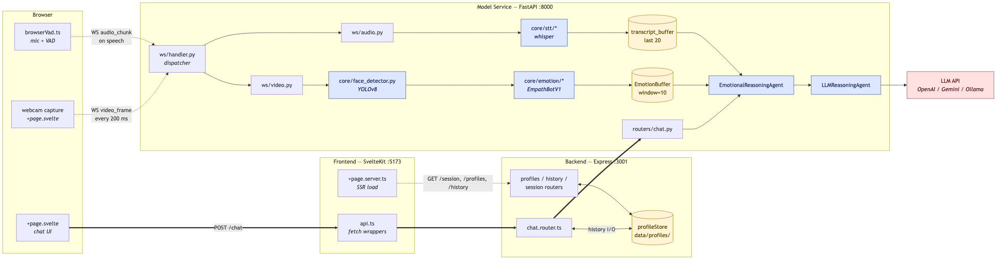
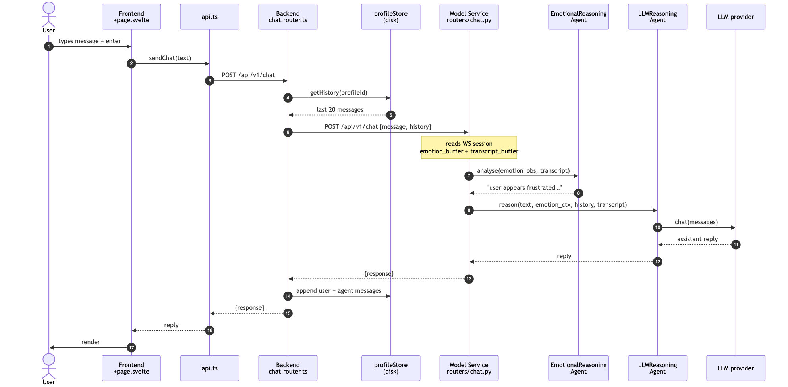

# Onboarding

Welcome to the team. This doc takes you from "I just cloned the repo" to "I shipped my first PR" in about a day of focused time, spread across three sessions.

If you've never seen this project before, read top to bottom. If you've been around but haven't touched the code, jump to **§2 — The pipeline in 60 seconds**.

This is the entry-point doc. Once you're past it, the [README](README.md), [ARCHITECTURE.md](ARCHITECTURE.md), and [CLAUDE.md](CLAUDE.md) take over as reference material — they're terse on purpose. This file is the only one written as a sequence.

---

## 1. What we're building

An **emotion-aware empathy bot**. A user opens the app, the webcam reads their face, a classifier tags their emotion (frustrated, anxious, neutral, …), and the LLM adjusts its tone in response — patient when they look stuck, calming when they look anxious. The same message gets a different reply depending on how they look saying it.

Full motivation (one paragraph): [Problem_Statement.md](Problem_Statement.md).

### Who's on the team and what we own

We're a small student team. Roughly:
- **Frontend / UX** — the SvelteKit app, webcam preview, chat surface, screens
- **Backend** — Express proxy, profile + history storage
- **ML / model service** — face detector, emotion classifier, STT, LLM glue
- **Reasoning / prompt design** — the system prompt, mode transitions, conversation flow
- **Report** — academic write-up in `report/`

Most of us touch several of these. Your sandbox folder (`sandbox/student_<your-name>/`) is your private playground — break things there without asking.

---

## 2. The pipeline in 60 seconds

Three services. The browser only ever talks to the frontend; everything else is internal.



**How to read this diagram:**
- **Solid arrows** = HTTP (the chat request flowing left to right along the bottom).
- **Dashed arrows** = WebSocket (the webcam + mic streams flowing into the model service).
- **Blue boxes** = ML components. **Yellow cylinders** = state/storage. **Pink** = external service.
- **Three concurrent flows:** the chat HTTP round trip (bottom), the video stream into `EmotionBuffer` (middle), and the audio stream into `transcript_buffer` (top). All three feed `EmotionalReasoningAgent` when a chat message arrives.

Source: [`diagrams/system-topology.mmd`](diagrams/system-topology.mmd) — edit the `.mmd`, then re-render with `npx -y -p @mermaid-js/mermaid-cli mmdc -i diagrams/system-topology.mmd -o diagrams/system-topology.png -b white -w 2400`.

| Service | Job | Lives in | Stack |
|---|---|---|---|
| Frontend | UI, webcam + mic capture, chat display | `application/frontend/` | SvelteKit, Svelte 5 runes |
| Backend | Profile + history storage. Thin proxy. | `application/backend/` | Express + TypeScript |
| Model | All ML — face, emotion, STT, LLM | `application/model_service/` | FastAPI + Python |

**Why three services and not one?** The model service is Python because the ML libraries are. The frontend is SvelteKit because that's our UI stack. The backend exists so the browser never holds session secrets or talks to the model directly — and so we can swap the model service without touching how profiles are stored.

---

## 3. Day 1 — Get it running

**Success looks like:**
- ✓ `http://localhost:5173` shows the empathy bot UI
- ✓ Your webcam preview appears with a box around your face
- ✓ Typing a message gets a reply within a couple of seconds

### Step 1. Install (one time)

```bash
git clone <repo>
cd hri-team-project
make install
```

`make install` runs `npm install` in frontend + backend, and `pip install -r requirements.txt` in the model service. Takes ~3 minutes.

### Step 2. Create your `.env` files (one time)

Each service has a `.env.example` checked in. Copy each to `.env`:

```bash
cp application/backend/.env.example       application/backend/.env
cp application/frontend/.env.example      application/frontend/.env
cp application/model_service/.env.example application/model_service/.env
```

Open `application/model_service/.env` and:
- Set `LLM_PROVIDER` to `openai` or `gemini` (or `ollama` if you run a local model)
- Set the matching API key (`OPENAI_API_KEY` or `GEMINI_API_KEY`) — ask a teammate if you don't have your own

Leave everything else default. The emotion classifier will start in **placeholder mode** (random labels) — that's fine for now.

### Step 3. Run everything

```bash
make dev
```

This starts all three services. Watch the log for:
- `[frontend]` → "Local:   http://localhost:5173"
- `[backend]` → "Server listening on port 3001"
- `[harness]` → "Application startup complete"

Open `http://localhost:5173`.

### Step 4. Sanity-check the round trip

Type "hello" in the chat. You should see a reply within ~2 seconds.

Now make different faces at the camera and watch the debug panel. Colours and the emotion label change in real time. They're random for now (placeholder mode) — that's expected.

### If something doesn't work

| Symptom | Try this |
|---|---|
| Ports already in use | `make kill`, then `make dev` again |
| Webcam / mic prompt didn't appear | Reload the tab; Chrome only prompts once per origin |
| `make install` fails on whisper.cpp | Set `STT_ENGINE=faster-whisper` in the model service `.env` and re-run. See [README §Run it in 60 seconds](README.md#run-it-in-60-seconds). |
| LLM call returns nothing | API key not set, or `LLM_PROVIDER` doesn't match the key you set |

---

## 4. Day 2 — Trace one message end-to-end

The fastest way to learn this codebase is to follow a single message from "user clicks send" to "user sees a reply."



Then open these files in this order alongside the diagram. Don't try to understand every line — just see the shape.

1. **`application/frontend/src/lib/components/ChatInput.svelte`** — user types, hits enter, calls `api.sendChat(text)`.
2. **`application/frontend/src/lib/api.ts`** — typed wrapper. POSTs to `/api/v1/chat` on Express.
3. **`application/backend/src/routes/chat.router.ts`** — Express handler. Reads the active profile, fetches history from disk, forwards to the model service.
4. **`application/model_service/routers/chat.py`** — FastAPI handler. Looks up the WebSocket session for this profile, runs `EmotionalReasoningAgent`, then `LLMReasoningAgent`.
5. **`application/model_service/core/llm/reasoning_agent.py`** — assembles the prompt: system persona + history + emotional context + transcript + the user's message. Calls the LLM.

That's the round trip.

**Two things the chat handler reads but you didn't see flow through it:**

- **Emotion buffer** — webcam frames stream over WebSocket independently. Each frame goes through the face detector → emotion model → a rolling 10-observation buffer. When you send a chat message, the handler reads that buffer.
- **Transcript buffer** — mic audio streams when you speak (browser-side VAD), goes over WebSocket, gets transcribed (whisper), and appended to a per-session transcript. The handler also reads that.

If you want function names and call chains for either of those flows, [ARCHITECTURE.md](ARCHITECTURE.md) has them. Dense — treat it as a reference, not bedtime reading.

---

## 5. Day 3 — Make your first change

Pick a small concrete change that touches the area you'll work in. Goals: prove you can edit + run + ship, get used to the PR flow. Suggestions:

| If you'll work on… | First change |
|---|---|
| Frontend | Change the placeholder text in `ChatInput.svelte`. Save. Hot reload shows it instantly. |
| Backend | Add a `serverTime` field to `/api/v1/session` in `application/backend/src/routes/session.router.ts`. `curl http://localhost:3001/api/v1/session`. |
| Reasoning / prompts | Edit `SYSTEM_PROMPT` in `application/model_service/core/llm/reasoning_agent.py`. Restart. Chat. The persona changes. |
| ML model | Set `EMOTION_VARIANT=resnet18` in the model service `.env`. (You'll need a checkpoint — see [README §Training a model](README.md#training-a-model).) |

When you're happy, follow **§7 — How we work** to open a PR.

---

## 6. The five pieces you'll touch most

Skim each location so you know where to start looking next time:

| What | Where | When you'll touch it |
|---|---|---|
| Frontend UI | `application/frontend/src/routes/+page.svelte` + `src/lib/components/` | Adding screens, components, UI states |
| Webcam / mic capture | `application/frontend/src/lib/harness/browserVad.ts` | Tweaking VAD thresholds, audio capture |
| Chat pipeline | `application/model_service/routers/chat.py` + `core/llm/reasoning_agent.py` | Anything about how the LLM responds |
| Emotion model | `application/model_service/core/emotion/` | Plugging in a new trained classifier |
| WebSocket pipeline | `application/model_service/ws/handler.py` | Anything that flows over WS (frames, audio) |

For the full file-by-file map: [CLAUDE.md](CLAUDE.md).

---

## 7. File-by-file rundown

A one-liner per source file in each service. Skim once now; come back when you need to find something specific.

### `application/frontend/` — SvelteKit + Svelte 5

The UI. One main route, a folder of components, a small set of state stores, and a "harness" that owns webcam + mic capture.

**Entry & routing** — what gets rendered when the browser loads:

| File | Purpose |
|---|---|
| `src/routes/+layout.svelte` | Outer wrapper; loads global CSS, renders `<slot />`. |
| `src/routes/+page.server.ts` | Server-side load — fetches session, profiles, history before render. |
| `src/routes/+page.svelte` | The main UI. Chat + webcam + transcript + debug panel. |
| `src/routes/dashboard/+page.svelte` | Stub for the future staff dashboard (Phase 6 in HANDOFF.md). |

**Browser harness** — owns the WebSocket to the model service and the webcam/mic capture loops:

| File | Purpose |
|---|---|
| `src/lib/harness/browserVad.ts` | Browser-side VAD; chunks mic audio when speech detected, sends WebM over WS. |
| `src/lib/harness/types.ts` | Shared constants (`FRAME_INTERVAL_MS`, `SPEECH_THRESHOLD`, `EMOTION_COLOURS`, …) + WS message types. |

**API client** — single source of truth for HTTP calls from the browser:

| File | Purpose |
|---|---|
| `src/lib/api.ts` | Typed fetch wrappers for every backend route (`sendChat`, `getProfiles`, `getHistory`, …). |

**Conversation state stores** — Svelte 5 `$state` runes that the UI reactively reads from:

| File | Purpose |
|---|---|
| `src/lib/conversation/store.svelte.ts` | Active mode (`qa` / `feedback` / `consent` / `done`), stage, turn counts, feedback events. |
| `src/lib/conversation/checkInState.svelte.ts` | Whether a check-in overlay/page is open and which step it's on. |
| `src/lib/conversation/sampleCheckIns.ts` | Spec types (`CheckInSpec`, `PageSpec`, …) plus debug fixtures bound to Shift+1..4. |
| `src/lib/conversation/uiState.ts` | `deriveAssistantPhase()` — pure function mapping connection/profile/listening flags → a single UI phase. |
| `src/lib/conversation/uiState.test.ts` | Vitest unit tests for `deriveAssistantPhase`. |

**Components** — building blocks rendered from `+page.svelte`:

| File | Purpose |
|---|---|
| `src/lib/components/AssistantBubble.svelte` | Speech-bubble layout for assistant text inside check-in surfaces. |
| `src/lib/components/Button.svelte` | Shared button with primary/secondary styling. |
| `src/lib/components/ChatHistory.svelte` | Scrollable conversation transcript. |
| `src/lib/components/ChatInput.svelte` | Textarea + submit + mic toggle. The main user input. |
| `src/lib/components/DebugDashboard.svelte` | Live timings, current emotion, frame rate, STT latency — fed by WS debug messages. |
| `src/lib/components/InlineAlert.svelte` | Warning callout used inside questionnaire pages. |
| `src/lib/components/ModePanel.svelte` | Overlay-style check-in surface (one or more sequential steps). |
| `src/lib/components/ProfileModal.svelte` | Profile create/select dialog. |
| `src/lib/components/QuestionCard.svelte` | One question + choices + reaction area (used inside QuestionnairePage). |
| `src/lib/components/QuestionnairePage.svelte` | Multi-question check-in page (elevation 2). |
| `src/lib/components/SideNotes.svelte` | Notes column for prompts/hints. |
| `src/lib/components/SpeakingCircle.svelte` | Audio-level visualiser around the mic UI. |
| `src/lib/components/TranscriptHistory.svelte` | Renders STT transcript chunks live. |
| `src/lib/components/WebcamPreview.svelte` | Live annotated webcam feed (with face box). |

**Reference scratchpad** (not shipped):

| File | Purpose |
|---|---|
| `src/.example/Svelte5Reference.svelte` | Quick cheat sheet for Svelte 5 runes — every pattern we use, in one file. |

---

### `application/backend/` — Express + TypeScript

Thin proxy. Owns profile + history storage on disk. Forwards chat to the model service.

**Bootstrap & app creation:**

| File | Purpose |
|---|---|
| `src/index.ts` | Server startup. Handles `EADDRINUSE` cleanly. |
| `src/app.ts` | CORS (hardcoded for :5173), express-session, mounts all routers. |
| `src/config/env.ts` | Every env var loaded and validated in one place. Import this, not `process.env`. |

**Persistence — files on disk, not a database:**

| File | Purpose |
|---|---|
| `src/lib/profileStore.ts` | Reads/writes `data/profiles/<uuid>.json` + `index.json`. No in-memory cache. |

**Middleware:**

| File | Purpose |
|---|---|
| `src/middleware/errorHandler.ts` | Catches anything routes pass to `next(err)` and returns a JSON error response. |

**Types — what's passed across boundaries:**

| File | Purpose |
|---|---|
| `src/types/profile.ts` | `Profile` / `Message` / `ProfileFile` shapes (file format on disk). |
| `src/types/session.d.ts` | Augments `express-session` so `req.session.profileId` is typed. |

**Routes — one file per domain, all mounted under `/api/v1/`:**

| File | Purpose |
|---|---|
| `src/routes/index.ts` | Mounts every router under `/api/v1/`. |
| `src/routes/chat.router.ts` | `POST /` — forwards to model service with history; graceful fallback on failure. |
| `src/routes/history.router.ts` | `GET /` and `POST /` — read/append messages for the active profile. |
| `src/routes/profiles.router.ts` | `GET /` list, `POST /` create, `POST /:id/select` — last sets the session cookie. |
| `src/routes/session.router.ts` | `GET /` — returns `{ profileId }` from the session cookie. |
| `src/routes/prediction.router.ts` | Stub. Forwards `POST /predict` to the model service. Currently unused. |

---

### `application/model_service/` — FastAPI + Python

All the ML work. Loads YOLO + emotion model + STT + LLM once at startup. Serves one HTTP endpoint and one WebSocket.

**Bootstrap & app creation:**

| File | Purpose |
|---|---|
| `main.py` | Uvicorn entry point. Run with `uvicorn app:app --reload`. |
| `app.py` | FastAPI app + lifespan (loads YOLO/emotion/STT/LLM) + mounts WS and routers. |
| `config.py` | All env vars + `load_model_registry()` — reads `models.yaml`. |
| `models.yaml` | Local registry: model id → checkpoint path + variant class. |

**HTTP — one route only:**

| File | Purpose |
|---|---|
| `routers/chat.py` | `POST /api/v1/chat`. Reads WS session, runs `EmotionalReasoningAgent` + `LLMReasoningAgent`. |

**WebSocket — receives webcam frames and mic audio, sends back debug + emotion + transcript:**

| File | Purpose |
|---|---|
| `ws/handler.py` | Main dispatcher. Routes `msg["type"]` to video / audio handlers. `pick_emotion()` lives here. |
| `ws/session.py` | `HarnessSession` (per profile), `_sessions` store, `get_session()`, `emit_debug()`. |
| `ws/audio.py` | ffmpeg decode (WebM → PCM) + `process_audio_chunk` (STT pipeline). |
| `ws/video.py` | `decode_frame`, `run_face_detection`, `encode_jpeg_b64` — pure frame utilities. |
| `ws/protocol.py` | Dataclass definitions of every WS message — documentation reference. |

**Core — `core/` is grouped by responsibility:**

*Face detection — single source of truth for "find a face in a frame":*

| File | Purpose |
|---|---|
| `core/face_detector.py` | YOLOv8-Face wrapper. `detect_best()` returns highest-confidence crop + box. |

*Emotion classification — swappable via `models.yaml`:*

| File | Purpose |
|---|---|
| `core/emotion/base.py` | `EmotionModel` ABC + `EMOTIONS` list (the 6-class label vocabulary). |
| `core/emotion/buffer.py` | `EmotionBuffer` (rolling deque, window=10) + `EmotionObservation` dataclass. |
| `core/emotion/factory.py` | `create_emotion_model(variant)` — branches on `EMOTION_MODEL_ID` / `EMOTION_VARIANT`. |
| `core/emotion/placeholder.py` | Random labels — default until a real checkpoint is configured. |
| `core/emotion/resnet18.py` | Vanilla torchvision ResNet18 + linear head. |
| `core/emotion/empathbot.py` | EmpathBotV1 (EfficientNet-B2 / ResNet18+SE). The "production" model. |

*Speech-to-text — two engines:*

| File | Purpose |
|---|---|
| `core/stt/base.py` | `TranscriptionService` ABC. |
| `core/stt/factory.py` | `create_stt(engine, model)`. |
| `core/stt/whisper_cpp.py` | whisper.cpp backend (default; needs `WHISPER_CPP_DIR`). |
| `core/stt/whisper_faster.py` | faster-whisper backend (CPU-friendly fallback). |

*LLM — provider behind one interface:*

| File | Purpose |
|---|---|
| `core/llm/base.py` | `LLMProvider` ABC + `Message` TypedDict. |
| `core/llm/factory.py` | `create_llm(provider, model)` — branches on `LLM_PROVIDER`. |
| `core/llm/openai.py` | OpenAI Chat Completions (working). |
| `core/llm/gemini.py` | Google Gemini (working). |
| `core/llm/ollama.py` | Local Ollama (implemented, lightly tested). |
| `core/llm/anthropic.py` | Stub — raises `NotImplementedError`. |
| `core/llm/claude_code.py` | Free-dev provider: shells out to the local `claude` CLI. No API key. |
| `core/llm/reasoning_agent.py` | `LLMReasoningAgent.reason()` — assembles the full message list each turn. |

*Reasoning + state — the "brains" outside the providers:*

| File | Purpose |
|---|---|
| `core/emotional_reasoning_agent.py` | Emotion buffer + transcript → context string injected into the LLM prompt. |
| `core/app_state.py` | Typed `HRIAppState` dataclass — fields for every loaded ML component. |
| `core/debug_flags.py` | Mutable runtime flags (cycle/force/log) seeded from `.env`. |
| `core/__init__.py` | Re-exports `debug_flags` for `from core import debug_flags`. |

---

## 8. How we work

We don't follow a strict production workflow — this is a learning project. Full philosophy: [CONTRIBUTIONS.md](CONTRIBUTIONS.md). The short version:

- **Every branch represents a question or a feature**, not a ticket.
- **Branch prefixes:**
  - `invest/<q>` — investigating something, stays in your sandbox
  - `integration/<q>` — landing the result into `application/`
  - `feat/<thing>` — product feature on the main app
  - `<student>-<name>` — personal scratch in your sandbox
- **`sandbox/student_<your-name>/`** is yours. Prototype, break things — no PR review needed.
- **Protected folders** — `application/`, `training_pipeline/`, `report/` need a PR with at least one approval.
- **Open PRs early.** Half-done with a clear question beats polished and silent.

### Shipping your first PR

```bash
git checkout main
git pull
git checkout -b <prefix>/<short-name>
# … make changes …
git add <files>
git commit -m "<type>(<area>): <what changed>"
git push -u origin <prefix>/<short-name>
gh pr create --base main --fill   # or use the GitHub UI
```

Direct pushes to `main` are blocked — everything lands via PR.

### Working on two branches at once

Use git worktrees to run two branches side by side without port collisions or duplicating the multi-GB `models/` directory. Full guide: [WORKTREES.md](WORKTREES.md).

---

## 9. Common stumbles

- **"It worked yesterday and now nothing loads."** Almost always a port still bound from a previous run. `make kill`.
- **"The LLM keeps timing out / returning empty."** Either no API key, or `LLM_PROVIDER` doesn't match the key you set. Check `application/model_service/.env`.
- **"Webcam works in one tab but not another."** Browsers gate webcam access per origin. Two tabs on `:5173` will fight over the camera.
- **"My emotion label is always random."** Placeholder mode. Switch to a real model via `EMOTION_MODEL_ID=empathbot_final` and drop the checkpoint at `models/empathbot/empath_final.pth`. See [README §Switching to the real model](README.md#switching-to-the-real-model).
- **"`make install` fails on whisper.cpp."** Default STT requires a manual build. Set `STT_ENGINE=faster-whisper` in the model service `.env` to skip it.
- **"Conflicts in `data/profiles/index.json` on every PR."** That file is local dev state and shouldn't ship in PRs. Reset it before pushing: `git checkout main -- application/backend/data/profiles/index.json`.

---

## 10. Where to go next

| You want to… | Read this |
|---|---|
| Run the app | [README.md](README.md) |
| Understand a specific data flow in detail | [ARCHITECTURE.md](ARCHITECTURE.md) |
| Find which file owns a behaviour | [CLAUDE.md](CLAUDE.md) |
| Add a new emotion model variant | [ARCHITECTURE.md](ARCHITECTURE.md) → "Integration Points" |
| Train a model from a notebook | [face_cropper/README.md](face_cropper/README.md) + [training_pipeline/README.md](training_pipeline/README.md) |
| Write the report | [report/README.md](report/README.md) |
| Work on two branches in parallel | [WORKTREES.md](WORKTREES.md) |
| Understand the branching philosophy | [CONTRIBUTIONS.md](CONTRIBUTIONS.md) |
| Pick up `feat/multi-page-flow` cold | [HANDOFF.md](HANDOFF.md) |

---

## A note on this doc

This is the **journey doc** — it's organised by what a new teammate does first, second, third. The other docs are **reference docs** — organised by topic, optimised for someone who already knows what they're looking for. Both shapes are useful; don't try to merge them.

If something in this file ever feels wrong or out of date, edit it. The truest sign of good onboarding is that yesterday's onboardee is fixing today's onboarding.
